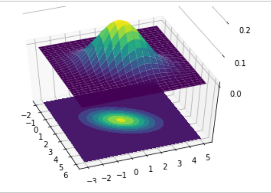

```{r setup, include=FALSE}
knitr::opts_chunk$set(collapse = FALSE)
library(tidyverse)
library(ggplot2)
library(knitr)
library(kableExtra)
library(extraDistr)
library(gridExtra)
library(latex2exp)
library(moments)
```

```{r, include=FALSE}
paygap <- read.csv('./data/gender-paygap-2019.csv')
paygap <- paygap %>%
  mutate(EmployerSize = factor(EmployerSize, levels = c('0-249','250-499','500-999','1000-4999','5000-19999','20000+')))
nycheat <- read.csv('./data/nyc-heatwave.csv')
```

\newcommand{\E}{\text{E}}
\newcommand{\Var}{\text{Var}}
\newcommand{\SD}{\text{SD}}
\newcommand{\SE}{\text{SE}}
\newcommand{\Cov}{\text{Cov}}
\newcommand{\Cor}{\text{Cor}}
\renewcommand{\P}{\text{P}}
\newcommand{\pd}[2]{\frac{\partial #1}{\partial #2}}
\newcommand{\sumin}{\sum_i^n}
\newcommand{\Bias}{\text{Bias}}

\renewcommand{\v}[1]
\renewcommand{\dv}[1]{\dot{\boldsymbol{#1}}}
\newcommand{\ddv}[1]{\ddot{\boldsymbol{#1}}}
\newcommand{\hv}[1]{\hat{\boldsymbol{#1}}}
\newcommand{\m}[1]{[ #1 ]}
\renewcommand{\t}[1]{\widetilde{\boldsymbol{#1}}}
\newcommand{\bfit}[1]{\textbf{\textit{#1}}}

\ 

# 14--1 Variance \& Covariance 

In previous chapters we introduced you to the **variance** as a measure of *spread* of a distribution:

$$\Var[X] = \E \big[ (X - \E[X] )^2 \big]$$

i.e. the variance is the expected value of the squared deviations from the mean. The variance can also be written as a sum:

$$\sigma^2 = \frac 1n \sum_i^n (X_i - \bar X)^2 \hspace{1cm} s^2 = \frac{1}{n-1}  \sum_i^n (X_i - \bar X)^2$$

where $\sigma^2$ denotes the population variance and $s^2$ denotes the sample variance.  

Variance is useful for characterizing the spread of one-dimensional data (i.e. a single variable). When dealing with multidimensional data (i.e. many variables) we're often interested in characterizing the *dependency* (i.e. association) between two variables, i.e. the tendency for variables to vary *together*. We already introduced you to *correlation* as a measure of the strength of the linear association between two variables. We'll now introduce the concept of dependence more formally. 

**Covariance** is a measure of the *joint variability* of two variables---it gives the extent to which two variables tend to vary *in the same direction*.  

Conceptually, covariance is similar to correlation. If two variables have a positive association, covariance is positive; if they have a negative association, covariance is negative. The difference between covariance and correlation is in their *units*---this point will become clear in the next section.  

Formally, the covariance of two variables $X$ and $Y$ is defined:

$$\Cov[X,Y] = \E \big[ (X - \E[X]) (Y - \E[Y] )\big]$$

Or, written as a sum:

$$\sigma_{XY} = \frac 1n \sum_i^n (X_i - \bar X)(Y_i - \bar Y) \hspace{1cm} s_{XY} = \frac{1}{n-1} \sum_i^n (X_i - \bar X)(Y_i - \bar Y)$$

where $\sigma_{XY}$ denotes the population covariance and $s_{XY}$ denotes the sample covariance.  

In R you can compute the covariance between two variables using `cov()`. Below is a plot of relationship between temperature and albedo from the NYC heatwave data:

```{r, echo=FALSE, fig.height=3.5, fig.width=5, fig.align='center'}
ggplot(aes(x = albedo, y = temperature), data = nycheat) +
  geom_point(size=1) +
  xlab('albedo (% solar reflectivity)') + ylab('temperature (farenheit)') +
  theme_bw()
```

The covariance of temperature and vegetation is:

```{r}
cov(nycheat$temperature, nycheat$albedo)
```

The units of covariance is simply the product of the units of the two variables.  

With a matrix of numeric variables, we can also construct a *covariance matrix* showing the pairwise covariances between each of the variables:

```{r}
vcov_table = cov(nycheat[ ,2:6])
kable(vcov_table)
```

You may notice that the diagonal elements of this matrix appear to show the covariance of a variable with *itself*. As it turns out, the covariance of a variable with itself is simply its *variance*. 

$$\Cov[X,X] = \E \big[ (X - \E[X])(X - \E[X]) \big] = \Var[X]$$

For this reason the covariance matrix is also known as the *variance-covariace matrix*. Formally, the variance-covariance matrix is denoted $\boldsymbol \Sigma$. For the three RVs $X$, $Y$ and $Z$:

$$
\boldsymbol \Sigma = 
\begin{bmatrix}
  \sigma^2_X & \sigma_{XY} & \sigma_{XZ} \\ 
  \sigma_{YX} & \sigma^2_y & \sigma_{YZ} \\ 
  \sigma_{ZX} & \sigma_{ZY} & \sigma^2_Z
\end{bmatrix}
$$

Earlier in the course you may recall us saying that variance is only additive for *independent* RVs, i.e. 

$$\Var[X+Y] = \Var[X]+\Var[Y] \hspace{1cm} (\text{iff X & Y independent})$$

We can now show why this is the case. Using the fact that $\Var[X] = \E[X^2] - \E[X]^2$, we can expand the $\Var[X+Y]$ as follows:

$$
\begin{aligned}
  \Var[X+Y] &=  \E \big[ (X+Y)^2 \big] - \E[X+Y]^2  \\ 
  &= \E \big[ X^2 + 2XY + Y^2 \big] - \big( \E[X]+\ \E[Y] \big)^2 \\ 
  &= \E[X^2]+\E[2XY]+E[Y^2] - \E[X]^2  - 2\E[X]E[Y] - \E[Y]^2 \\ 
  &= \big( \E[X^2] - \E[X]^2 \big) + \big( \E[Y^2] - \E[Y]^2 \big) + 2 \big(E[XY] - \E[X]\E[Y] \big) \\ 
  &= \Var[X] + \Var[Y] + 2\Cov[X,Y]
\end{aligned}
$$

i.e. the variance of a sum of RVs has a *third* term that accounts for the *dependency* of the two variables. Naturally, if the variables are independent, they have zero covariance, and the expression for variance reduces to the simple two-term sum. 


\ 

# 14--2 Correlation 

One issue with covariance is that its units are the product of the units of the two variables. This means that covariance can take *any* number, and its magnitude depends on the units the variables are measured in---variables measured in large values will have large covariances, and variables measured in small values will have small covariances. E.g. in the covariance matrix above note that the covariance terms involving `pop_density` tend to be very large---this is because population takes values in the millions, while most of the other variables takes smaller values.  

This makes it hard to compare covariances between different sets of variables, since covariance is intrinsically a unit-dependent quantity.  

**Correlation** solves this issue by dividing covariance by the standard deviations of each of the variables. Formally, the correlation between two variables $X$ and $Y$ is defined:

$$\Cor[X,Y] = \frac{\E \big[ (X - \E[X]) (Y - \E[Y] )\big]}{\sigma_X \sigma_Y}$$

Or, written as a sum:

$$\rho_{XY} = \frac 1n \frac{\sum_i^n (X_i - \bar X)(Y_i - \bar Y)}{\sigma_X \sigma_Y} \hspace{1cm} r_{XY} = \frac{1}{n-1} \frac{\sum_i^n (X_i - \bar X)(Y_i - \bar Y)}{s_X s_Y}$$

where $\rho_{XY}$ denotes the population correlation and $r_{XY}$ denotes the sample correlation. Note this particular definition of correlation is known as **Pearson's product-moment correlation coefficient**^[Or PPMCC, as the cool kids say.]. 

Correlation is a *unitless* quantity---it effectively *normalizes* covariance, reducing it to a quantity between -1 and 1, making it possible to compare the *strength* of the joint variability (dependence) between sets of two variables.  

In R you can use `cor()` to compute correlation coefficient between two variables:

```{r}
cor(nycheat$temperature, nycheat$albedo)
```

Below is a correlation matrix for the variables in the NYC heatwave dataset:

```{r}
cor_table = cor(nycheat[ ,2:6])
kable(cor_table)
```

Since correlation is unitless, we can directly compare the correlations between different sets of variables (e.g. we can say the correlation between `temperature` and `building_height` is stronger than the correlation between `temperature` and `pop_density`. Note how we cannot do this with the covariance matrix.)

Note that correlation (and covariance) are only receptive to *linear* relationships between variables. Below are some examples of scatterplots showing different kinds of association between two variables:

```{r fig-fullwidth, fig.width = 10, fig.height = 2, echo=FALSE}
knitr::include_graphics('./pics/m1c4_pic2.png')
```

The bottom row shows examples of *nonlinear* associations. Though these variables are clearly associated, they have zero correlation.  


\ 

# 14--3 Multivariate Normal 

We introduced the normal distribution in chapter 9, as the continuous probability distribution with the density function:  

$$\text{pdf}(X) = \frac{1}{\sqrt{2\pi\sigma^2}}e^{-(X-\mu)^2/2\sigma^2}$$

Sometimes this is known as the **univariate** normal distribution, since it's a function of one random variable, $X$.  

Often in statistics we must deal with a *combination* of random variables (e.g. in multiple regression). In these situations we can generalize the simple normal distribution to higher dimensions---this is known as the **multivariate normal** or **joint normal** distribution.  

Consider a random vector $\v X = (\v X_1, \v X_2, ..., \v X_k)$, which is a collection of $k$ random variables. This random vector is multivariate normal if every linear combination of its RVs is normally distributed, e.g. if

$$a_1 \v X_1 + a_2 \v X_2 + ... + a_k \v X_k$$

has a normal distribution for each of the constants $a_1, a_2, ...$ etc.  

The random vector $\v X$ is said to have mean vector $\v \mu$ and covariance matrix $\v \Sigma$:

$$\v \mu = \big[ \E[X_1], \E[X_2], ..., \E[X_k] \big]$$
\ 

$$
\v \Sigma = 
\begin{bmatrix}
  \sigma^2_{X_1} & \sigma_{X_1,X_2} & ... & \sigma_{X_1,X_k} \\ 
  \sigma_{X_2,X_1} & \sigma^2_{X_2} & ... & \sigma_{X_2,X_k} \\ 
  \vdots & \vdots & \ddots & \vdots \\ 
  \sigma_{X_k, X_1} & \sigma_{X_k, X_2} & ... & \sigma^2_{X_k}
\end{bmatrix}
$$

Its *joint* probability density function is:

$$\frac{1}{\sqrt{(2\pi)^k | \v \Sigma |}} \exp\big(-\tfrac 12 (\v  X - \v \mu)^T \v \Sigma^{-1} (\v X -\v\mu) \big)$$

Which can be expressed using the following shorthand:

$$\v X \sim \mathcal N \big( \v \mu, \v \Sigma \big)$$

\newenvironment{psmallmatrix}
  {\left(\begin{smallmatrix}}
  {\end{smallmatrix}\right)}

Example---consider the random vector $\v X = (X_1, X_2)$, which is bivariate normal with mean vector $\v \mu = \big[\begin{smallmatrix} 2 \\ 1 \end{smallmatrix} \big]$ and covariance matrix $\v \Sigma = \big[ \begin{smallmatrix} 1 \\ 0 \end{smallmatrix} \begin{smallmatrix} 0 \\ 1.5 \end{smallmatrix} \big]$ (i.e. $X_1$ and $X_2$ are uncorrelated). Below is a plot showing the 3D bivariate normal for $X_1$ and $X_2$, overlaid on a heatmap:

```{r, echo=FALSE, fig.align='center'}
knitr::include_graphics('./pics/ch14-pic2.png')
```

Below is an example with *correlated* RVs---consider the random vector $\v X$ with mean vector $\v \mu = \big[\begin{smallmatrix} 2 \\ 1 \end{smallmatrix} \big]$ and covariance matrix $\v \Sigma = \big[ \begin{smallmatrix} 1 \\ 0.4 \end{smallmatrix} \begin{smallmatrix} 0.9 \\ 1.5 \end{smallmatrix} \big]$: 

```{r, echo=FALSE, fig.align='center'}

```

\ 
