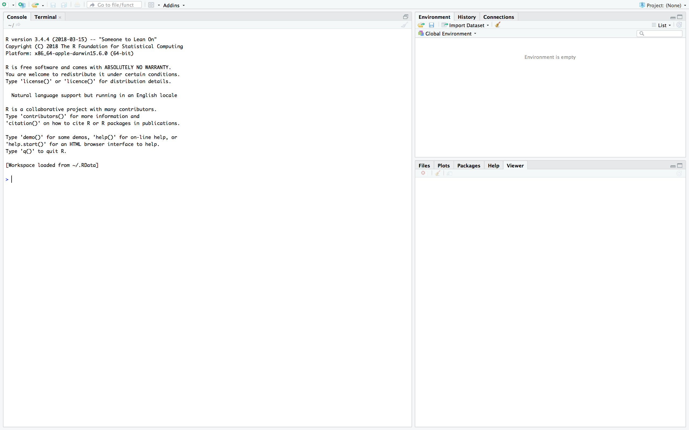
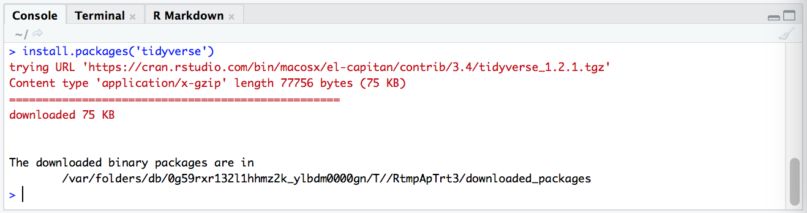

```{r setup, include=FALSE}
knitr::opts_chunk$set(collapse = FALSE)
library(tidyverse)
library(ggplot2)
library(knitr)
library(kableExtra)
library(extraDistr)
library(gridExtra)
library(latex2exp)
library(moments)
library(bookdown)
library(rsconnect)
library(tufte)
```

\newcommand{\E}{\text{E}}
\newcommand{\Var}{\text{Var}}
\newcommand{\SD}{\text{SD}}
\newcommand{\SE}{\text{SE}}
\newcommand{\Cov}{\text{Cov}}
\newcommand{\Cor}{\text{Cor}}
\renewcommand{\P}{\text{P}}
\newcommand{\pd}[2]{\frac{\partial #1}{\partial #2}}
\newcommand{\sumin}{\sum_i^n}
\newcommand{\Bias}{\text{Bias}}

---

# Installing R and RStudio 

R is a programming language for statistical computing. To use R on your computer, you should install both R and RStudio.  

* to install R, go to CRAN -- https://cloud.r-project.org/ -- and click the link for your OS.^[On the Mac download page, choose the version under 'Latest Release'. On the Windows download page, choose the 'base' subdirectory, then click download at the top.] 
* to install RStudio go here -- https://www.rstudio.com/download -- and choose the free open source licence.  


\ 

---

# RStudio 

RStudio is an IDE (integrated development environment). It is essentially an interface you can use to write and debug R code.^[Don't confuse R with RStudio. R is a programming language--you can think of it as an 'engine' that runs commands. RStudio is an environment where you can write R code and run it using the R language.] Any time you want to do work using R, open RStudio.^[In fact, you don't have to use RStudio--or an IDE at all--to use R. You could theoretically use any text editor to write R code, then simply run the commands using R in the command line. But if you are new to coding, you may find it easier to use an IDE.]  

When you first open RStudio you will see three panes:  

```{r, echo=FALSE}

```

The left-hand pane is the **console**--this is where R code is evaluated and its output is shown. Type any command (e.g. 5 + 3) in the console and press enter. You should see the output in the following line.  

The two right-hand panes show extra information about your R session--you will come to learn what they do as you code.    

Note, commands you type in the console will not be not saved--the console only evaluates code. To save your code, you must write it in a script file.  

To open a new R script file click the icon in the top left and choose R Script, as follows: 

```{r, echo=FALSE}
knitr::include_graphics('./pics/m1c1_pic2.png')
```

The script editor will open as a new pane in the top left. Anything you write here can be run in the console, and when you are done, you can save it as a .R file.  

To run code you have written in the script editor, click 'Run' (top right). The current line (or the selected lines) will be run in the console, producing an output.  

```{r, echo=FALSE} 
knitr::include_graphics('./pics/m1c1_pic3.png')
```


\ 

---

# Some Coding Basics 

\ 

## Objects 

Objects are where values are stored. You can create objects using the **assignment operator**, `<-`. This evaluates the expression on its right hand side and assigns the result to the object name on its left.^[Technically you can use either `<-` or `=` for object assignment. Both do the same thing when used for assignment, though in general there is a subtle difference between the two.]  

E.g. to assign the value 12 to a new object called $x$:

```{r}
x <- 12
```

You can create a **vector**--a one-dimensional array of values--by using `c()`, with commas to separate the values:

`r margin_note("Hashes (#) denote **comments**--anything written after a hash symbol will be skipped by the console when running code. It is a good idea to comment your code, i.e. describe what it is doing.")` 

`r margin_note("Note the **colon operator**, : , which generates a sequence of integer numbers between those specified.")`  

```{r}
# create vector of integers from 0 to 9
some_numbers <- c(0,1,2,3,4,5,6,7,8,9)

# alternatively 
some_numbers <- c(0:9)
```

The objects you have defined in a session will appear in the Environment pane (top right). You can call an object by simply typing its name. The value(s) of the object will appear in the console: 

```{r}
some_numbers
```

\ 

## R functions

Just like mathematical functions, R functions perform operations on objects. R has many inbuilt functions--e.g. the `c()` function which takes a series of values and returns a vector array, or `mean()` function which takes a vector array of numbers and returns its average value. 

```{r}
mean(some_numbers)
```

Syntactically, functions are denoted by a name followed by brackets. What you type in the brackets is the function's **argument**--this is the input you are giving to the function. Most functions accept several arguments, some of which are mandatory while others are optional. Usually the first argument(s) are for specifying the object(s) you want the function to operate on, and additional arguments are for specifying how you want the function to operate. If you leave optional arguments blank when calling a function, it will operate according to its default settings. 

To learn about the arguments and default settings of a function, you should look up its documentation. You can do this by typing the function's name in the 'Help' tab (bottom right pane). E.g. for the `mean()` function: 

```{r, echo=FALSE}
knitr::include_graphics('./pics/m1c1_pic4.png')
```


\ 

---

# R Packages

A package is essentially a bundle of R functions. These are functions that have been written by other people and posted to CRAN. `r margin_note("You too, could write your own functions and submit a package to CRAN.")` These packages are not included in Base R, and must be installed separately. Some common R packages you will encounter:

- `ggplot2` - has functions for plotting data
- `dplyr` - has functions for cleaning/manipulating data 
- `stats` - has functions for statistical calculations and random number generation  

The **tidyverse** is a set of eight common R packages used in data analysis. It includes `ggplot2` and `dplyr`. When you start out in R, loading the tidyverse packages is a good idea.  

To install a package, use the command `install.packages()` in the console. E.g. to install the tidyverse packages:

`r margin_note("Remember to add quotation marks around the package name.")`    

```{r, echo=FALSE}

```

Once a package is installed, you needn't install it again. But to use the functions in a package, you need to load the package into the session using `library()`. You will need to do this every time you enter a new R session.  

```{r}
library(tidyverse)
```

If you run this code and get the error message "there is no package called 'tidyverse'", you need to first install it, then run `library()` again.  

It is common practice to load whichever packages you need at the beginning of your script file. This will save you the hassle of remembering which packages you used and retyping them each time you enter a new session.  


\ 

--- 

# R Markdown

R Markdown is a format for creating unified documents with R. Unlike the R script format introduced above, R Markdown allows you to combine code, its output, and text annotations in a single document.  

To open a new R Markdown file, click on the top left icon and choose R Markdown. You will see the following options menu:

```{r, echo=FALSE}
knitr::include_graphics('./pics/m1c1_pic5.png')
```

Enter a name and title for your document (these can be changed later). You can choose whichever output format you wish, but note that for pdf output you will need to have some form of TeX installed on your computer.^[Get it <a href="https://www.latex-project.org/get/">here</a>.] For simplicity you should use html output.   

After choosing your output format you will be greeted by some sample Markdown script, as follows: 

```{r, echo=FALSE}
knitr::include_graphics('./pics/m1c1_pic6.png')
```

The grey boxes are **code chunks**. Only stuff written in the code chunks will be treated as code and evaluated in the console. To run a code chunk, click the green arrow in the top right of chunk. The output will be printed below. Everything outside the code chunks will appear as text in your output document. To insert a new code chunk, click on Code > Insert Chunk (from the menu bar) or use a shortcut^[Mac: cmd+option+I. Windows: ctrl+alt+I.].  

Now go ahead and compile the document (i.e. create the output file) by clicking 'Knit'. You will need to have saved the file first. A separate window will open with the output file--you should compare this to the script file and make note of how R Markdown translates from script to its output format.  

```{r, echo=FALSE}
knitr::include_graphics('./pics/m1c1_pic7.png')
```

You should experiment with R Markdown and get used to its syntax. Here is a R Markdown <a href="base64 data" download="./downloads/rmd-cheatsheet.pdf">cheatsheet</a>.  


\ 

---

\ 

