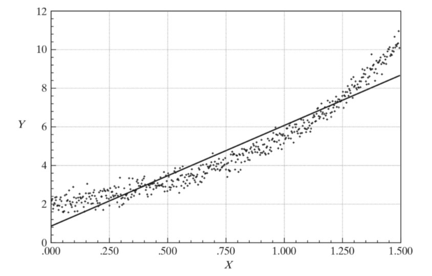
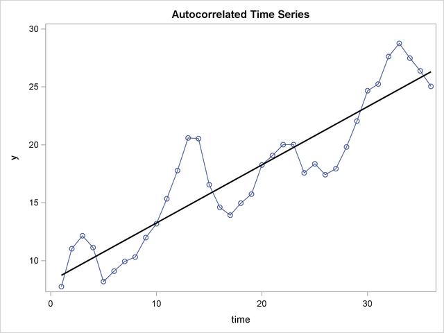
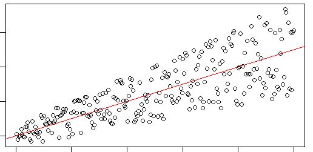
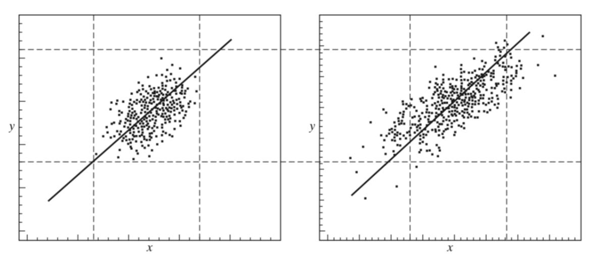

```{r setup, include=FALSE}
knitr::opts_chunk$set(collapse = FALSE)
library(tidyverse)
library(ggplot2)
library(knitr)
library(kableExtra)
library(extraDistr)
library(gridExtra)
library(latex2exp)
library(moments)
library(tufte)
library(scatterplot3d)
```

```{r, include=FALSE}
paygap <- read.csv('./data/gender-paygap-2019.csv')
paygap <- paygap %>%
  mutate(EmployerSize = factor(EmployerSize, levels = c('0-249','250-499','500-999','1000-4999','5000-19999','20000+')))
nycheat <- read.csv('./data/nyc-heatwave.csv')
```

\newcommand{\E}{\text{E}}
\newcommand{\Var}{\text{Var}}
\newcommand{\SD}{\text{SD}}
\newcommand{\SE}{\text{SE}}
\newcommand{\Cov}{\text{Cov}}
\newcommand{\Cor}{\text{Cor}}
\renewcommand{\P}{\text{P}}
\newcommand{\pd}[2]{\frac{\partial #1}{\partial #2}}
\newcommand{\sumin}{\sum_i^n}
\newcommand{\Bias}{\text{Bias}}

\newcommand{\SSR}{\text{SSR}}

\newcommand{\mhat}[1]{\skew{3}\hat{#1}}

\renewcommand{\v}[1]
\renewcommand{\dv}[1]{\dot{\boldsymbol{#1}}}
\newcommand{\ddv}[1]{\ddot{\boldsymbol{#1}}}
\newcommand{\hv}[1]{\hat{\boldsymbol{#1}}}
\newcommand{\m}[1]{[ #1 ]}
\renewcommand{\t}[1]{\widetilde{\boldsymbol{#1}}}
\newcommand{\bfit}[1]{\textbf{\textit{#1}}}

\ 

# 15--1 Regression Coefficients as Estimates

In module 1 we introduced linear regression as a technique for modeling linearly related variables. We now have the tools to consider regression models with a little more rigour.   

Recall the general form of a regression model:

$$y = \beta_0 + \beta_1  x_1 + \beta_2 x_2 + ... + \beta_k x_k + \varepsilon$$

where $y$ is the outcome variable, $x_1, ..., x_k$ are a set of $k$ predictor variables, $\beta_1, ..., \beta_k$ are their respective coefficients ($\beta_0$ is the $y$-intercept), and $\varepsilon$ represents the error terms or residuals of the model.  

Recall that in a regression model, the coefficient $\beta$ on a particular variable describes the effect of that variable on the response variable, while holding the other predictors constant (i.e. while *controlling* for the effects of the other predictors).   

The equation specified above is known as the **population regression equation**, and the symbol $\beta$ denotes the **population regression coefficient** (i.e. the coefficient we would get if we ran the regression on population data). Of course, for a given sample of data, the regression coefficients we compute are only *estimates* for the true coefficients, and like all other estimates they are subject to the whims of variability. We typically use a different symbol, $b$, to represent the **estimated regression equation:**

$$y = b_0 + b_1x_1 + b_2 x_2 + ... + b_k x_k + e$$

where $b_1, ..., b_k$ are the set of *estimated* regression coefficients, and $e$ represents the *estimated* error terms of the model. This recasts the regression equation as an estimation problem: our goal is to use sample data to *estimate* the true regression coefficients.  

In the terminology of expectation, the regression equation is just another way of saying $\E[y | x]$, i.e. the *expected value* of $y$ given $x$.  In the case of multiple predictors, we can say $\E[y | x_1, ..., x_k]$.  


\ 

# 15--2 The Method of Least Squares 

The technique most commonly used to fit the regression line is known as the **method of least squares**. This technique involves finding the coefficients $b$ that minimize the model's sum of squared errors (SSR).     

In a simple (bivariate) regression, it turns out the value for $b_1$ that minimizes the sum of squared errors is given by:

$$b_1 = r_{xy}\frac{s_y}{s_x}$$

where $r_{xy}$ is the sample correlation coefficient between $x$ and $y$, and $s_y$ and $s_x$ are the sample standard deviations of $y$ and $x$. The proof for this is below.  

## Bivariate Derivation  

Given sample data on two variables, $y$ and $x$, the regression equation predicting $y$ given $x$ is:

```{r, echo=FALSE, fig.margin = TRUE, warning=FALSE}

reg1 <- lm(formula = temperature ~ vegetation, data = nycheat)

nycheat <- nycheat %>%
  mutate(temperature_prediction = predict(reg1))

ggplot(data = nycheat, mapping = aes(x = vegetation, y = temperature)) +
  geom_point(size = 0.7, alpha = 0.5) +
  stat_smooth(method='lm', se = FALSE) +
  geom_segment(aes(x = vegetation, xend = vegetation, y = temperature, yend = temperature_prediction), 
               alpha = 0.3, color = 'black') +
  xlab("X") + ylab("Y") + 
  geom_text(x = 0.6, y = 110, label = TeX("$b_0$ = ?"), color = 'blue', size = 10) + 
  geom_text(x = 0.6, y = 105, label = TeX("$b_1$ = ?"), color = 'blue', size = 10) + 
  theme_light()
```

$$y_i = b_0 + b_1 x_i + e_i$$

Our goal is to find $b_0$ and $b_1$ such that the sum of squared residuals (SSR) of this model is minimized---see the figure on the right. 

To do this, first rearrange the regression equation to get the residuals as a function of $b_0$ and $b_1$:


$$e_i = e_i(b_0,b_1) = y_i - b_0 - b_1 x_i$$

The squared residuals are simply $(e_i)^2 = (y_i - b_0 - b_1 x_i)^2$, and the sum of squared residuals is:

$$\SSR(b_0,b_1) = \sum_i^n (y_i - b_0 - b_1 x_i)^2$$

To find $b_0$ for which $\SSR$ is minimum, set the partial derivative of $\SSR$ with respect to $b_0$ equal to zero:

$$\frac{\partial{\SSR}}{\partial b_0} = -2 \sum_i^n(y_i - b_0 - b_1 x_i) = 0$$

Rearrange, and use the fact that $\frac 1n \sum_i^n y_i = \bar y$, to solve for $b_0$:

$$
\begin{aligned}
  \sum_i^n b_0 &= \sum_i^n y_i - \sum_i^n b_1 x_i \\ 
  b_0 &= \frac 1n \sum_i^n y_i - \frac 1n \sum_i^n b_1 x_i \\ 
  b_0 &= \bar y - b_1 \bar x
\end{aligned}  
$$

Next, to find $b_1$ for which $\SSR$ is minimum, set the partial derivative of $\SSR$ with respect to $b_1$ equal to zero:

$$\frac{\partial{\SSR}}{\partial b_1} = -2 \sum_i^n x_i (y_i - b_0 - b_1 x_i) = 0$$

Rearrange to solve for $b_1$:

$$
\begin{aligned}
  \sum_i^n b_1 x_i^2 &= \sum_i^n x_i y_i - \sum_i^n x_i b_0 \\ 
  &= \sum_i^n x_i y_i - \sum_i^n x_i (\bar y - b_1 \bar x) \\ 
  &= \sum_i^n x_i y_i - \sum_i^n x_i \bar y - \sum_i^n x_i b_1 \bar x \\ 
\end{aligned}  
$$

$$
\begin{aligned}
  b_1 \sum_i^n x_i^2 &= \sum_i^n x_i y_i - N \bar x \bar y - b_1 N \bar x^2 \\ 
  b_1 &= \frac{\sum_i^n x_i y_i - N \bar x \bar y}{\sum_i^n x_i^2 - N \bar x^2} \\ 
  b_1 &= \frac{\sum_i^n (x_i - \bar x)(y_i - \bar y)}{\sum_i^n (x_i - \bar x)^2} = \frac{s_{xy}}{s_x^2} = r_{xy} \frac{s_y}{s_x}
\end{aligned}
$$

where we have used the fact that $\sum_i^n x_i y_i - N \bar x \bar y = \sum_i^n (x_i - \bar x)(y_i - \bar y)$. Note $s_{xy}$ denotes the sample covariance between $x$ and $y$.  

Thus, in a bivariate regression of $y$ on $x$, the coefficients that uniquely minimize the model's sum of squared residuals are given by:

$$b_1 = r_{xy} \frac{s_y}{s_x}$$

$$b_0 = \bar y - b_1 \bar x$$

## Multivariate derivation 

Given multivariate sample data, the regression equation predicting $y$ given the set of $k$ predictor variables $x_1, ..., x_k$ is:

$$y_i = b_0 + b_1 x_{i1} + b_2 x_{i2} + ... + b_k x_{ik}$$

Or, in vector notation:

$$\v y = \v X \v b + \v e$$

$$
\begin{bmatrix}
  y_1 \\ y_2 \\ \vdots \\ y_n
\end{bmatrix}
= 
\begin{bmatrix}
  1 & x_{11} & ... & x_{1k} \\ 
  1 & x_{21} & ... & x_{2k} \\ 
  \vdots & \vdots & \ddots & \vdots \\ 
  1 & x_{n1} & ... & x_{nk}
\end{bmatrix}
\cdot 
\begin{bmatrix}
  b_0 \\ b_1 \\ \vdots \\ b_k
\end{bmatrix}
+ 
\begin{bmatrix}
  e_{1} \\ e_{2} \\ \vdots \\ e_{n}
\end{bmatrix}
$$

```{r, echo=FALSE, fig.margin = TRUE, warning=FALSE}
wh <- iris$Species != "setosa"
x1  <- iris$Sepal.Width[wh]
y  <- iris$Sepal.Length[wh]
x2  <- iris$Petal.Width[wh]
df <- data.frame(x1, y, x2)
LM <- lm(y ~ x1 + x2, df)

s3d <- scatterplot3d(x1, x2, y, pch = 19, type = "p", color = "darkgrey",
                     main = "regression plane", grid = TRUE, box = FALSE,  
                     mar = c(2.5, 2.5, 2, 1.5), angle = 55)

# compute locations of segments
orig     <- s3d$xyz.convert(x1, x2, y)
plane    <- s3d$xyz.convert(x1, x2, fitted(LM))
i.negpos <- 1 + (resid(LM) > 0) # which residuals are above the plane?

# draw residual distances to regression plane
segments(orig$x, orig$y, plane$x, plane$y, col = "red", lty = c(2, 1)[i.negpos], 
         lwd = 1.5)

# draw the regression plane
s3d$plane3d(LM, draw_polygon = TRUE, draw_lines = TRUE, 
            polygon_args = list(col = rgb(0.8, 0.8, 0.8, 0.8)))

# redraw positive residuals and segments above the plane
wh <- resid(LM) > 0
segments(orig$x[wh], orig$y[wh], plane$x[wh], plane$y[wh], col = "red", lty = 1, lwd = 1.5)
s3d$points3d(x1[wh], x2[wh], y[wh], pch = 19)
```

Our goal is to find the coefficients $b_0, ..., b_k$ such that the SSR of the model is minimized. Note when there are two or more predictors in a regression model, the equation no longer describes a line, but rather a *plane*---the figure on the right shows an example of a regression model with two predictors, $x_1$ and $x_2$, and the fitted regression plane and its residuals. If the model has more than two predictors, we can't use this 3D visualization directly, but the idea is the same. 

Below is the multivariate derivation of least squares regression coefficients---it involves a little linear algebra:

$$\v e (\v b) = \v y - \v X \v b$$

$$\SSR(\v b) = \v e^T \v e = (\v y - \v X \v b)^2 = \v y^T \v y - 2 \v y^T \v X \v b + \v b^T \v X^T \v X \v B$$

$$\SSR(\v b)_{\text{min}} = \pd{\SSR(\v b)}{\v b} = -2 \v y^T \v X + 2 \v X^T \v X \v b$$

Thus $\v b$ must satisfy $\v X^T \v X \v b = \v X^T \v y$, and:

`r margin_note("Note the superscript $T$ denotes transpose, i.e. $\\v X^T$ is the transpose of the matrix $\\v X$.")`

$$\v b = (\v X^T \v X)^{-1} \v X^T \v y$$

\ 


# 15--3 The Assumptions of LS Regression 

Linear regression models have a set of assumptions that are required for the method of least squares to work (i.e. in order for LS to deliver unbiased estimates of the regression coefficients). These assumptions concern *how* the data is produced (the data generating process). 

## Linearity 

The relationship between $y$ and each of the $k$ predictors must be linear. Sometimes it's possible to transform inherently nonlinear relationships to linear ones using a simple mathematical transformation. Often you'll see models that contain log-transformed variables or powers of variables, e.g.

$$y = \beta_0 + \beta_1 \log x_1 + \beta_2 \log x_2 + ...$$

This is useful in cases where the relationship between $y$ and $x_1$ is not linear, but the relation between $y$ and $\log x_1$ is.  

The takeaway---the regression equation must be *linear in parameters*. But it doesn't necessarily have to be linear in the variables themselves.  

## Uncorrelated, Mean-Zero Errors 

The expected value of the error terms must be zero, conditional on the predictor(s): 

$$\E[\varepsilon | \v X] = 0$$

Note that $\E[\varepsilon] = 0$ does not imply $\E[\varepsilon | \v X] = 0$---the latter is a stronger condition. Below is an example of a situation where $\E[\varepsilon]=0$ (the errors technically have a mean of zero) but $\E[\varepsilon | \v X] \neq 0$:

```{r, echo=FALSE, fig.align='center'}

```

Here it's clear that changing $X$ changes the mean of the error terms. LS regression requires that $X$ can be varied *without* changing the mean error, i.e. that $X$ is *independent* of $\E[\varepsilon]$.  

There are two corollaries to this assumption:

_**1. The errors are uncorrelated with the regressor(s):**_

$$\Cov[\varepsilon, \v X] = 0$$

The above plot shows an example of error terms that are correlated with the regressor, since the mean of $\varepsilon$ is clearly *dependent* on the value of $X$.  

_**2. The errors are uncorrelated with each other:**_

$$\Cov[\varepsilon_i, \varepsilon_j] = 0$$

When error are correlated with each other, it's known as **autocorrelation**. This is when the value of the error at a point *depends* on the value of the error at a previous point. You can see autocorrelation in a scatterplot--are the errors repeatedly positive, then repeatedly negative, and so on? Below is an example of autocorrelation: 

```{r, echo=FALSE, fig.align='center'}

```

You usually get autocorrelation in time series data---and there are various methods for dealing with it. We will discuss these later. 


## Constant-Variance Errors 

The variance of the error terms must be constant:

$$\Var[\varepsilon | \v X] = 0$$

which also implies that:

$$\Cov[\varepsilon_i, \varepsilon_j, \v X ] = 0$$

i.e. the spread of the error terms must be constant over the whole range of $X$. Errors with constant variance are known as **homoscedastic errors**.  

Below is an example of a model where the variance of the errors *increases* with $X$:

```{r, echo=FALSE, fig.align='center'}

```

This is an example of **heteroscedasticity** (errors with non-constant variance), which violates the linear regression assumptions.  


## No Multicollinearity 

Multicollinearity is when two or more predictors are *highly* correlated with each other. It becomes difficult for LS regression to compute regression coefficients if predictors are strongly correlated.^[The technical reason is that the invertibility of the matrix $\v X^T \v X$ requires that it has <a href="https://stattrek.com/matrix-algebra/matrix-rank.aspx">full rank</a>. If predictors are highly correlated, this is equivalent to there being an exact (or near-exact) linear dependency in the data, which reduces the rank of the matrix.] You can test for multicollinearity by looking at a correlation matrix of the predictors---the best way to deal with multicollinearity is to simply remove the highly correlated predictors. 

While LS regression can control for the effect of minor correlations between predictors, it becomes problematic if the correlation is very high. If you run a regression in R and get the error `"prediction from a rank-deficient fit may be misleading"` or `"linear dependency in data"`, this is a sign there is multicollinearity in the data.  

## Normal Errors

Another assumption is that the error terms are normally distributed with mean zero and variance $\sigma^2$:

$$\varepsilon | X \sim \mathcal N (0, \sigma^2)$$
But this assumption can generally be relaxed when $n$ is large, since the CLT gives asymptotically normal errors even if they aren't normally distributed, provided $n$ is large enough. 


\ 

# 15--4 Asymptotic Properties of the LS Estimator 


We can use the CLT to show that when $n$ is large, the estimated regression coefficients become asymptotically normal, with $\E[b] = \beta$.  

For a simple regression:

$$b \sim \mathcal N \bigg( \beta \;\; , \;\; \frac{\sigma^2}{\sum_i^n (x_i - \bar x)^2} \bigg)$$

For multiple regression:

$$\v b \sim \mathcal N \bigg( \v \beta \;\; , \;\; \sigma^2 (\v X^T \v X)^{-1} \bigg)$$

## Variance of the LS Estimator

In a simple regression, the variance of the regression LS estimator is is:

$$\Var[b_1] = \frac{\sigma^2}{\sum_i^n (x_i - \bar x)^2}$$

The greater the variation in $x$, the smaller the variance of $b$, i.e. more variation in the data gives a more precise estimate of $b$:

```{r, echo=FALSE, fig.align='center'}

```

The data shown on the right will give a more precise estimate of $b$.  


## The Gauss-Markov theorem

Provided all the regression assumptions are satisfied, the method of least squares gives unbiased estimates of the regression coefficients that have the *smallest variance* of any other estimator. The Gauss-Markov theorem is as follows:

**In a linear model with homoscedastic errors, the LS estimator is BLUE (the Best Linear Unbiased Estimator)**.  

If errors are not homoscedastic, the LS estimator is stll unbiased, provided the errors are uncorrelated and have zero mean. But if this assumption isn't satisfied, i.e. $\E[\varepsilon | \v x] \neq 0$, LS is no longer the smallest variance estimator (see: <a href="https://en.wikipedia.org/wiki/Generalized_least_squares">Generalized Least Squares</a>).  

\ 
